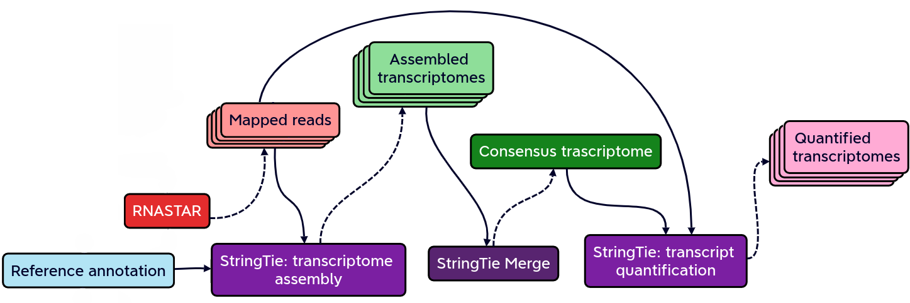

### **Galaxy pipeline for the identification of non-canonical ORFs and their potential biological function**

Cristobal Gallardo Alba

2023.07.06

---

### Index of contents

- 1. Introduction
- 2. Galaxy workflow
- 3. Preliminary results

---

Introduction

 

### 1. Introduction

- 1.1. What do we mean by *non-canonical ORFs*?

- 1.2. Why study non-canonical ORFs?

- 1.3. Why have not been yet characterized?

- 1.4. How identify non-canonical ORFs?

------

 What do we mean by non-canonical ORFs?

#### What do we mean by *non-canonical ORFs*?

Mean Ribo-Seq expression and Ribo-Seq expression standard deviation (SD). 

Source: Erady, Chaitanya, et al. "Pan-cancer analysis of transcripts encoding novel open-reading frames (nORFs) and their potential biological functions." NPJ Genomic Medicine 6.1 (2021): 4.

Note:
nORFs are uncharacterized and unnanotated open-reading frames with functional relevance.

------

 

### 1. Introduction

- 1.1. What do we mean by *non-canonical ORFs*?

- 1.2. Why study non-canonical ORFs?

- 1.3. Why have not been yet characterized?

- 1.4. How identify non-canonical ORFs?

------

Why study non-canonical ORFs?

### Why study non-canonical ORFs?

- Potentially novel <b>prognostic and diagnostic markers</b>

- The vast majority <b>have not been investigated</b>

- Particulary attractive as <b>allosteric celullar regulators</b>

------

 

### 1. Introduction

- 1.1. What do we mean by *non-canonical ORFs*?

- 1.2. Why study non-canonical ORFs?

- 1.3. Why have not been yet characterized?

- 1.4. How identify non-canonical ORFs?

------

Why have not been characterized?

### Why have not been characterized?

 

- Arbitrary thresholds on ORF lengths
    - Peptides smaller than 100 aminoacids are usually discarted

- Frequently annotated as non-coding RNAs

- Propensity for structural disorder
    -  Discarted as intrinsically disordered proteins (IDPs)

------

Why study small peptides?

### Why study small peptides?

Example: In eukaryotes, small proteins upregulate proteases and chaperones and downregulate protein synthesis when cells encounter ER stress. 

Source: Steinberg, R., & Koch, H. G. (2021). The largely unexplored biology of small proteins in pro- and eukaryotes. The FEBS journal, 288(24), 7002-7024.

------

### Why have not been characterized?

 

- Arbitrary thresholds on ORF lengths
    - Peptides smaller than 100 aminoacids are usually discarted

- Frequently annotated as non-coding RNAs

- Propensity for structural disorder
    -  Discarted as intrinsically disordered proteins (IDPs)

------

Annotated as non-coding RNAs?

#### Annotated as non-coding RNAs?

------

### Why have not been characterized?

 

- Arbitrary thresholds on ORF lengths
    - Peptides smaller than 100 aminoacids are usually discarted

- Frequently annotated as non-coding RNAs

- Propensity for structural disorder
    -  Discarted as intrinsically disordered proteins (IDPs) 

------

Why study intrinsically disordered proteins (IDP)?

#### Why study intrinsically disordered proteins (IDP)?

Source: Babu, M. M., Kriwacki, R. W., & Pappu, R. V. (2012). Versatility from protein disorder. Science, 337(6101), 1460-1461.

<b>Disorder-Function Paradigm</b>

Source: Chakrabarti, P., & Chakravarty, D. (2022). Intrinsically disordered proteins/regions and insight into their biomolecular interactions. Biophysical Chemistry, 283, 106769.

------

 

### 1. Introduction

- 1.1. What do we mean by *non-canonical ORFs*?

- 1.2. Why study non-canonical ORFs?

- 1.3. Why have not been yet characterized?

- 1.4. How identify non-canonical ORFs?

------

How identify non-canonical ORFs?

### How identify non-canonical ORFs?

---

### Index of contents

- 1. Introduction
- 2. Galaxy workflow
- 3. Preliminary results

------

Galaxy Workflow

#### Galaxy Workflow

Full detailed explanation in the <a href="https://gxy.io/GTN:T00345">Genome-wide alternative splicing analysis</a> Galaxy training. 

Full detailed explanation in the <a href="https://gxy.io/GTN:T00345">Genome-wide alternative splicing analysis</a> Galaxy training. 

Full detailed explanation in the <a href="https://gxy.io/GTN:T00345">Genome-wide alternative splicing analysis</a> Galaxy training. 

### Initial QC assessment

Identify potential artifacts that may impact the interpretation of downstream analysis.

#### Mapping and identication of novel splicing sites with RNASTAR

Two-pass alignment enables sequence reads to span novel splice junctions by fewer nucleotides, conferring greater read depth and providing significantly more accurate quantification of novel splice junctions.

#### Post-mapping QC assessment with RSeQC

 RSeQC is a toolkit for generating RNA-seq-specific quality control metrics. The figure corresponds to RSeQC junction saturation of known (A) and novel (B) splicing sites.

#### Reference-based transcriptome assembly and quantification with StringTie

StringTie is a fast and highly efficient assembler of RNA-seq alignments into potential transcripts.

#### Post-assembly QC assessment with rnaQUAST

rnaQUAST, which will provide us diverse completeness/correctness statistics very useful in order to identify and address potential errors or gaps in the assembly process. The figure is a rnaQUAST cummulative isoform plot.

#### Isoform switching and functional analysis with IsoformSwitchAnalyzeR

IsoformSwitchAnalyzieR performs the differential isoform usage analysis by using DEXSeq.

#### Isoform switching and functional analysis with IsoformSwitchAnalyzeR

To analyze large-scale patterns in predicted IS consequences, IsoformSwitchAnalyzeR computes all isoform switching events resulting in a gain/loss of a specific consequence (e.g. protein domain gain/loss).

---

### Index of contents

- 1. Introduction
- 2. Galaxy workflow
- 3. Preliminary results

------

Preliminary results

#### Preliminary results

The complete analysis can be found in this <a href="https://usegalaxy.eu/u/gallardoalba/h/genome-wide-splicing-history">Galaxy history</a>.

The complete analysis can be found in this <a href="https://usegalaxy.eu/u/gallardoalba/h/genome-wide-splicing-history">Galaxy history</a>.

---

Thanks for you attention!
