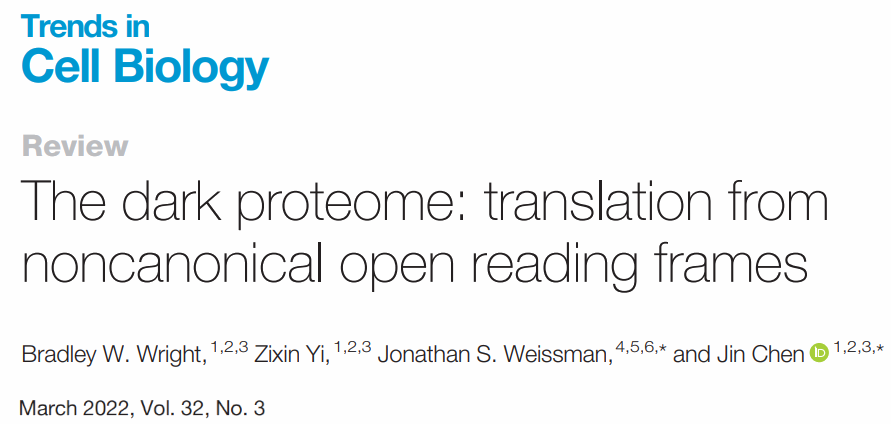

### **Galaxy pipeline for the identification of non-canonical ORFs and their potential biological function**

Cristobal Gallardo Alba

2023.07.06

---

### Index of contents

- Introduction
- Galaxy pipeline description
- Conclusion

---

Introduction

#### Introduction

#### What do we mean by *non-canonical ORFs*?

Note:
nORFs are uncharacterized and unnanotated open-reading frames with functional relevance.

------

Introduction

#### Introduction

Mean Ribo-Seq expression and Ribo-Seq expression standard deviation (SD)

 Source: Erady, Chaitanya, et al. "Pan-cancer analysis of transcripts encoding novel open-reading frames (nORFs) and their potential biological functions." NPJ Genomic Medicine 6.1 (2021): 4.

Note:
Canonical ORFs are depicted as blue dots and novel ORFs are depicted by orange dots. The black line shows the median expression SD of canonical ORFs. Not all nORFs have noisy expression values, many have similar SD vs. mean expression values as that of canonical ORFs (cORFs).

------

Introduction

#### Introduction

### Why study non-canonical ORFs?

- Potentially novel prognostic and diagnostic markers
- The vast majority of non-canonical peptides have not been investigated
- Particulary attractive as allosteric celullar regulators

------

#### Introduction

### Why have not been yet characterized?

- Arbitrary thresholds on ORF lengths
- Annotated as noncoding RNAs or pseudogenes
- Propensity for structural disorder

------

#### Introduction

#### Why study intrinsically disordered proteins (IDP)?

Allostery mediated by IDPs ensures robust and efficient signal integration through <b>mechanisms that would be extremely unfavorable or even impossible for globular protein interaction partners</b>.

 <small><small>Berlow, R. B., Dyson, H. J., & Wright, P. E. (2018). Expanding the paradigm: intrinsically disordered proteins and allosteric regulation. Journal of molecular biology, 430(16), 2309-2320.</small></small>

------

Introduction

#### Introduction

### How identify non-canonical ORFs?

---

### Galaxy pipeline decription

---

Thanks for you attention!
